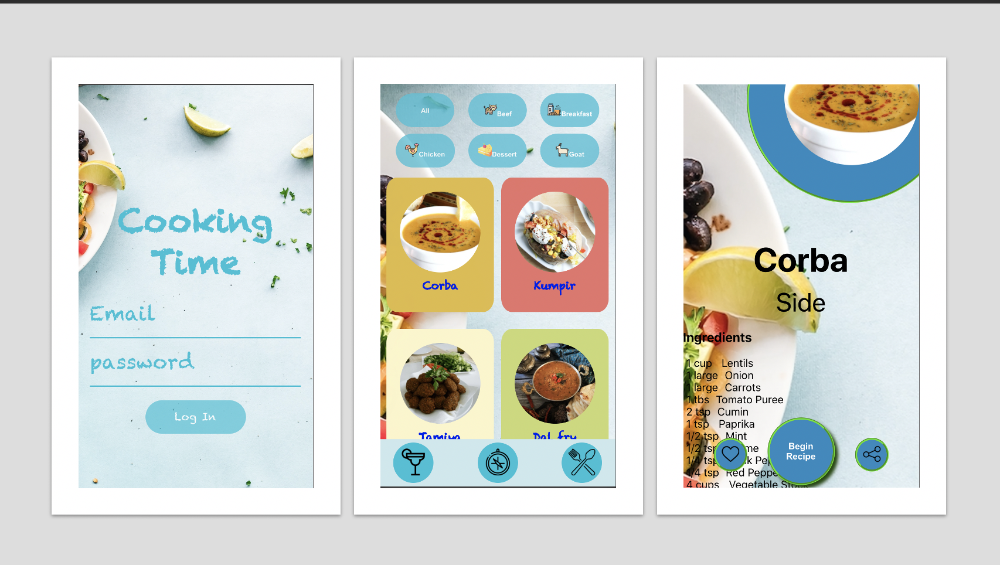

# Recipe App

This application was built as the las front end module project fot the Trybe course. A 10-days-long team project which had the progress managed through the agile metodology.

As the data source, the following public API were used:

- [The Meal DB](https://www.themealdb.com/)
- [The Cocktail DB](https://www.thecocktaildb.com/)

The application was built with React and its Context API and Hooks.

The App has few features including: 

- A login page
- A initial pache which can show meals and drinks cards after selection in the bottom bar
- A search bar 
- A detailed page containing the ingredients and how to prepare the meal/cocktail. The recipe can be favorited and the link can be copied.
- A follow up page which shows the progress of the meal/cocktails
- A page showing the done recipes
- A page showing the favorited recipes
- A discover menu

A deployed version of the application can be found on: fabemiliano.github.io/recipe-app
